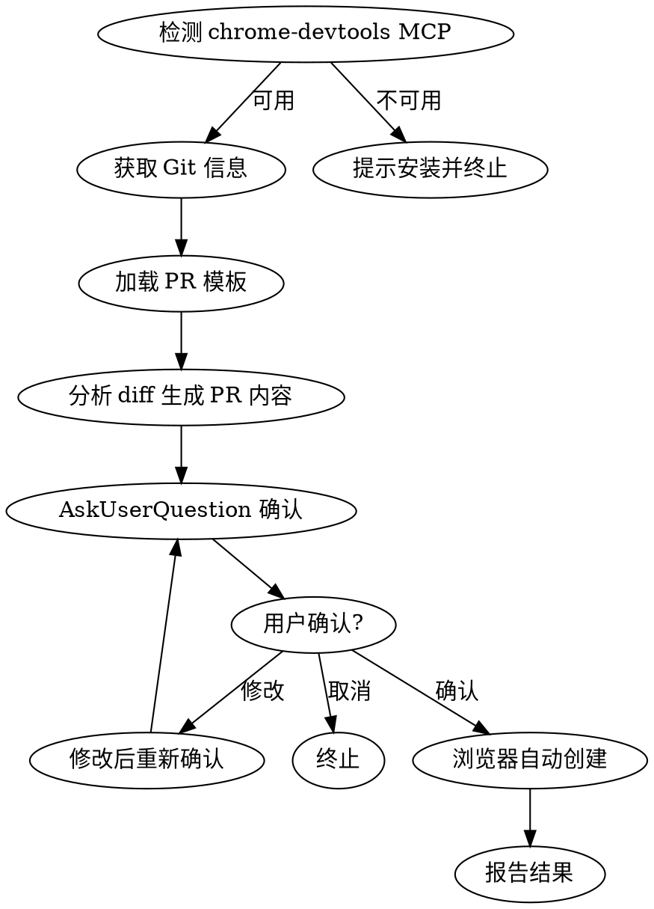

# 创建 Gitee Pull Request

使用 chrome-devtools MCP 工具通过浏览器自动化创建 Pull Request。

## 参数

- `<target_branch>`: 可选，目标分支，默认为 `dev`

## 使用方式

```
/fe-dev:gitee-pr
/fe-dev:gitee-pr master
```

## 前置条件

- 浏览器已打开并登录 code.iflytek.com
- chrome-devtools MCP 已连接到浏览器

## 执行流程

### 步骤 0: 检测 chrome-devtools MCP

检测 `mcp__chrome-devtools__navigate_page` 工具是否可用。

**不可用时**，通过 AskUserQuestion 提示用户安装：

```
chrome-devtools MCP 未安装，gitee-pr 需要此依赖通过浏览器自动创建 PR。

安装方式：在 ~/.claude.json 的 mcpServers 中添加：

Chrome 用户：
  {"chrome-devtools": {"command": "npx", "args": ["-y", "chrome-devtools-mcp@latest", "--autoConnect"]}}

Edge 用户：
  {"chrome-devtools": {"command": "npx", "args": ["-y", "chrome-devtools-mcp@latest", "--browser-url=http://127.0.0.1:9222"]}}

Chrome 还需在地址栏打开 chrome://inspect/#remote-debugging 开启远程调试。
Edge 需通过命令行启动：/Applications/Microsoft\ Edge.app/Contents/MacOS/Microsoft\ Edge --remote-debugging-port=9222

详见：https://github.com/ChromeDevTools/chrome-devtools-mcp
```

提示后终止执行，等待用户配置完成后重新运行。



### 步骤 1: 获取 Git 信息

**重要：所有 git 命令必须使用 `git -C {projectRoot}` 形式，禁止使用 `cd && git`。**

```bash
# 获取当前分支（作为 source）
git -C {projectRoot} branch --show-current

# 获取远程仓库 URL，解析出仓库路径
git -C {projectRoot} remote get-url origin
# 从 URL 中提取 {repoPath}：
#   SSH:   ssh://git@code.iflytek.com:30004/org/group/repo.git → org/group/repo
#   SSH:   git@code.iflytek.com:org/group/repo.git → org/group/repo
#   HTTPS: https://code.iflytek.com/org/group/repo.git → org/group/repo
# 注意：Web URL 需要加 osc/_source/ 前缀，即最终 URL 为：
#   https://code.iflytek.com/osc/_source/{repoPath}/...

# 获取提交历史（target 默认为 dev）
git -C {projectRoot} log origin/{target}..{source} --oneline

# 获取变更文件列表及统计
git -C {projectRoot} diff origin/{target}..{source} --stat
```

### 步骤 2: 加载 PR 描述模板

按优先级查找模板：

1. **项目模板**（优先）：当前项目 `docs/pr-template.md`
2. **内置模板**（兜底）：`<skill-path>/references/pr-template.md`

```
# 尝试读取项目模板
Read: {projectRoot}/docs/pr-template.md

# 如果不存在，使用内置模板
Read: <skill-path>/references/pr-template.md
```

### 步骤 3: 分析提交并生成 PR 内容

#### PR 标题

从提交历史中提取主要变更类型和范围，生成简洁标题：
- 格式：`type(scope): 简要描述`
- 多种类型时取最主要的，或用 `feat+fix(scope): 描述`

#### PR 描述

根据 `git log` 和 `git diff --stat` 的结果，**按加载的模板结构**填充内容。

**填充规则：**
- 勾选匹配的变更类型 checkbox（将 `- [ ]` 改为 `- [x]`）
- 替换 `<!-- -->` 注释占位符为实际内容
- 从 commit message 整体归纳变更内容和原因，说明 WHY 而非 WHAT
- 如果 commit message 中包含 issue 编号或链接则提取填入相关链接，否则保留默认值
- 保留模板中的所有 section 结构，即使某些 section 内容为空也保留标题

### 步骤 4: 使用 AskUserQuestion 确认

向用户展示完整的 PR 标题和描述预览，提供选项：

- **确认无误，直接创建**
- **修改标题** — 用户通过 Other 输入新标题
- **修改描述内容** — 用户补充或重写描述
- **取消创建**

用户选择修改时，更新对应内容后重新确认（循环回步骤 4）。

### 步骤 5: 通过 chrome-devtools 自动创建 PR

**关键原则：使用 take_snapshot 获取页面元素 uid，通过 uid 操作元素。**

#### 5.1 导航到 PR 创建页面

```
mcp__chrome-devtools__navigate_page
  type: "url"
  url: "https://code.iflytek.com/osc/_source/{repoPath}/-/pull_requests/new?source_branch={sourceBranch}&target_branch={targetBranch}"
```

> `{repoPath}` 从步骤 1 的 `git remote get-url origin` 中解析得到（如 `CBG_AIM/OVERSEAS_AD/overseas-affiliate`）。

#### 5.2 等待页面加载

```
mcp__chrome-devtools__wait_for
  text: ["创建合并请求", "新建 Pull Request", "Create Pull Request"]
```

#### 5.3 获取页面快照并填写标题

```
mcp__chrome-devtools__take_snapshot
```

从快照中找到标题输入框和保存按钮的 uid，然后填写标题：

```
mcp__chrome-devtools__fill
  uid: "{标题输入框uid}"
  value: "{prTitle}"
```

#### 5.4 填写描述（Vditor 富文本编辑器）

**描述框是 Vditor 富文本编辑器，不能用 `fill`。必须先点击编辑器区域获取焦点，再用 `evaluate_script` 操作 DOM。**

**关键：必须先用 `click` 点击编辑器区域，否则 `svEditor.focus()` 可能不生效，内容会被插入到标题框。**

从快照中找到描述编辑器区域的 uid（通常是包含占位文字"描述此 Pull Request 都做了哪些事情"的 generic 元素），先点击：

```
mcp__chrome-devtools__click
  uid: "{描述编辑器区域uid}"
```

然后用 `evaluate_script` 插入 Markdown 内容：

```
mcp__chrome-devtools__evaluate_script
  function: "() => {
    const svEditor = document.querySelector('.vditor-sv.vditor-reset');
    if (!svEditor) return 'editor not found';
    svEditor.focus();
    document.execCommand('selectAll', false);
    document.execCommand('insertText', false, `{prDescription}`);
    return 'ok';
  }"
```

**注意：** `{prDescription}` 中的反引号需要转义。如果 `.vditor-sv` 找不到，降级尝试 `[contenteditable="true"]`。

#### 5.5 截图确认后提交

```
mcp__chrome-devtools__take_screenshot
```

确认表单内容正确后，点击保存按钮：

```
mcp__chrome-devtools__click
  uid: "{保存按钮uid}"
```

#### 5.6 等待跳转并获取 PR 链接

```
mcp__chrome-devtools__wait_for
  text: ["已创建", "合并请求"]

mcp__chrome-devtools__evaluate_script
  function: "() => { return window.location.href; }"
```

### 步骤 6: 报告结果

```
PR 创建成功！

标题: {prTitle}
源分支: {sourceBranch} → 目标分支: {targetBranch}

PR 链接: {prUrl}
```

## 错误处理

| 场景 | 处理方式 |
|------|----------|
| 页面加载超时 | 提示用户检查网络连接和浏览器登录状态 |
| 快照中找不到表单元素 | 重新 take_snapshot，或提示用户手动检查页面是否正常 |
| 点击提交后未跳转 | take_screenshot 截图查看页面状态，可能有表单验证错误 |
| 浏览器未连接 | 提示用户确认 chrome-devtools MCP 已连接 |

## 注意事项

1. **始终用 take_snapshot 获取 uid**，不要猜测或硬编码 uid，每次页面加载后 uid 会变化
2. **fill 前先清空**：如果输入框有默认值，先点击选中再填写
3. **页面结构可能变化**：Gitee 页面更新后元素名称/结构可能不同，以实际快照为准
4. **弹窗确认处理**：Gitee 的关闭 PR、删除等危险操作会弹出确认对话框。点击按钮后如果 `wait_for` 超时，应先 `take_snapshot` 检查是否有弹窗（通常包含"确定"/"取消"按钮），如有则点击"确定"完成操作
